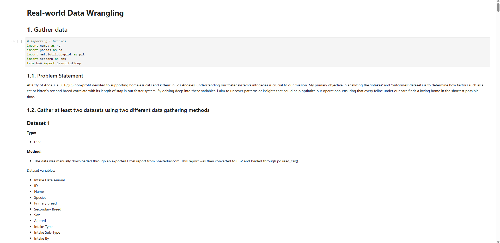

# Real-World Data Wrangling for Nonprofit Foster System

**By:** Matthew Morrow

**Live Demo:** [matthewmorrow.github.io/koa-foster-intake-outcome-analysis/](https://matthewmorrow.github.io/koa-foster-intake-outcome-analysis/)

**Project Context:**  Analyzing real-world data from Kitty of Angels' foster system to gain insights into animal intake and outcome patterns, showcasing data wrangling and cleaning skills.

**Goal:**  Investigate how factors like animal sex and breed relate to the length of stay in foster care.  Demonstrate proficiency in handling messy, real-world datasets to extract meaningful information.

**Key Skills Showcased:**

*   Real-World Data Wrangling:  Experience gathering data from multiple sources (CSV, HTML), assessing data quality, and implementing robust cleaning steps.
*   Data Quality Assessment & Cleaning:  Identifies and addresses validity, completeness, relevancy, and tidiness issues in raw datasets.
*   Data Merging & Transformation:  Merges datasets and creates new features (e.g., 'Length of Stay') for analysis.
*   Python for Data Analysis (Pandas, BeautifulSoup): Leverages Python libraries for data manipulation, web scraping (HTML parsing), and initial data exploration.

**Project Files:** `koa-foster-intake-outcome-analysis.ipynb` (Jupyter Notebook), data CSVs, `Foster_Outcomes_Shelterluv.html`, `README.md`.

---
*Portfolio Demonstration Only*
